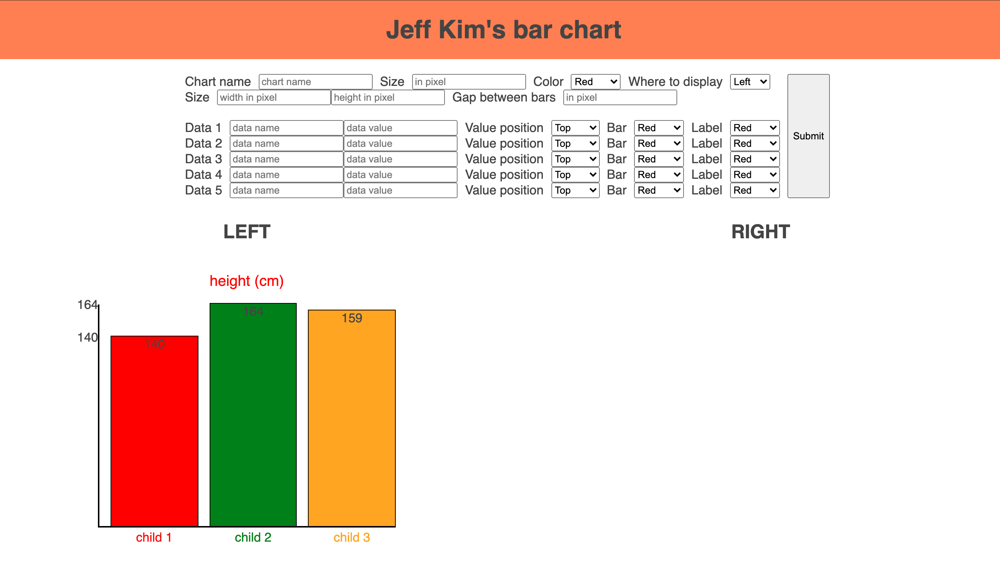

# JEFF KIM'S BAR CHART

Add upto 5 datas with chart options and it will display either on the left or the right side depending on the input.

you can customize each bar such as colors of bar and label

JQEURY crash course on Youtube was very helpful; https://youtu.be/VlWsJHsVb-E
